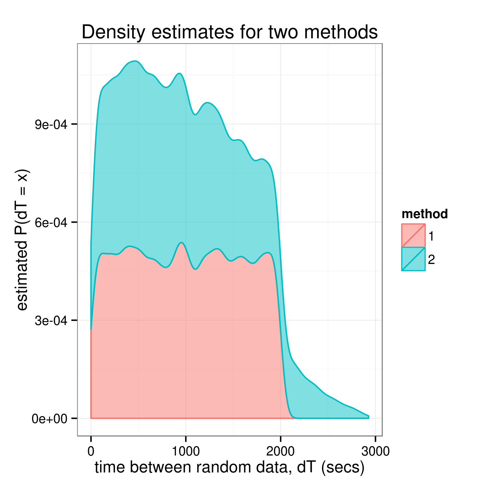

TL;DR
==========
* `rand1.js` produces timestamps that seem to have uniformly distributed temporal spacing. Meaning,
  the time between any two timestamps is uniformly distributed between 0 and 2000 seconds.
* The spacing between data generated by `rand2.js` is not only _*not*_ statistically equivalent to that
  of `rand1.js`, but it's not even uniformly spaced across its range.

Repo Structure / Methodology
====================
Two javascript methods, [source_js/rand1.js](source_js/rand1.js) and [source_js/rand2.js](source_js/rand2.js),
were used to generate random data, [code/data1.txt](code/data1.txt) and [code/data2.txt](code/data2.txt),
at random times. The question that the analysis, here, sets out to answer is

> _Are the intervals between datum from `rand1.js` "equivalent" to those found between datum_
> _from `rand2.js`?_

Where we mean "equivalent" in the sense that their (statistical) distributions are (approximately)
equal. 

The fastest way to answer this is to first look at the histograms & empirical cumulative distribution
functions, see if they look similar, and follow up with more rigorous analysis if they do. You can
find all the analysis in [code/analyzeKoljasData.R](code/analyzeKoljasData.R).

Results
=============================
Without a doubt, these methods are producing ***unequal*** distributions.
Meaning, the spacing between when random data is generated is _not_ the same
for the two methods. More importantly, the graphical analysis (below) 
indicates that `rand1.js` produces a uniform spacing, whereas `rand2.js`
has some weird tail behaviour...

### Graphical Analysis:



### Kolmogorov-Smirnoff Test:
Running a two-sided [K-S test](https://en.wikipedia.org/wiki/Kolmogorov%E2%80%93Smirnov_test)
yielded an unsurprisingly low _p-value_ (the `R` equivalent of a 0 _p-value_...)
```R
ks.test(x = deltaTime[method == "1", dT],
	    y = deltaTime[method == "2", dT],
     	alternative = "two",
	    exact = FALSE)
```
```
        Two-sample Kolmogorov-Smirnov test

data:  deltaTime[method == "1", dT] and deltaTime[method == "2", dT]
D = 0.081816, p-value < 2.2e-16
alternative hypothesis: two-sided

Warning message:
In ks.test(x = deltaTime[method == "1", dT], y = deltaTime[method ==  :
  p-value will be approximate in the presence of ties
```
 
