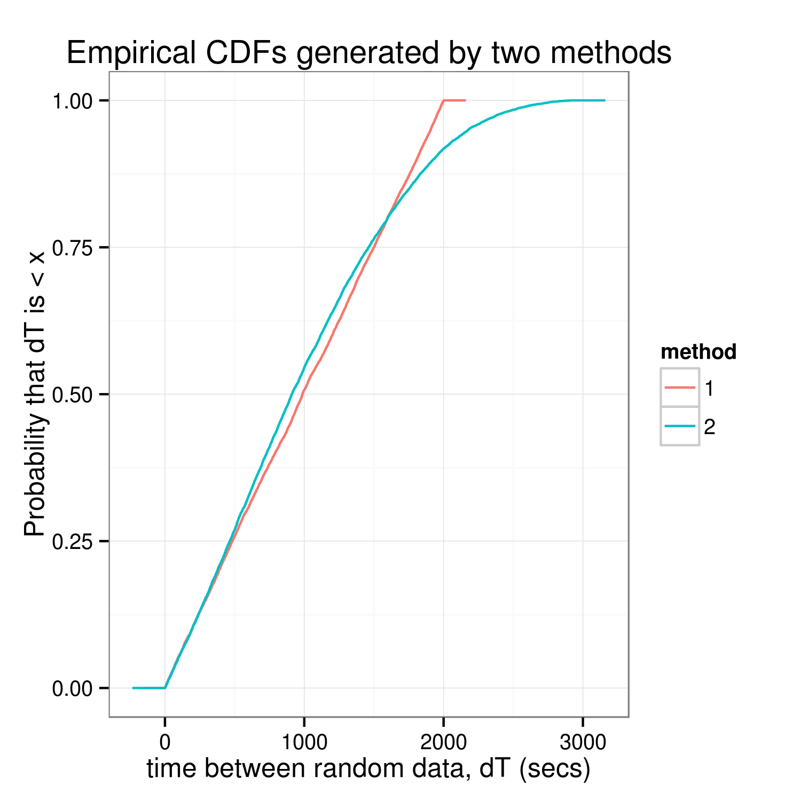

# random_timestamps
Analyze Kolja's random timestamps...

### Summary:
Without a doubt, these methods are producing ***unequal*** distributions.
Meaning, the spacing between when random data is generated is _not_ the sam
for the two methods. More importantly, the graphical analysis (below) 
indicates that `rand1.js` produces a uniform spacing, whereas `rand2.js`
has some weird tail behaviour...

### Graphical Analysis:


### Kolmogorov-Smirnoff Test:
Running a two-sided [K-S test]() yielded an unsurprisingly low _p-value_
 (the `R` equivalent of a 0 _p-value_...)
```R
ks.test(x = deltaTime[method == "1", dT],
	y = deltaTime[method == "2", dT],
	alternative = "two",
	exact = FALSE)
```
```
        Two-sample Kolmogorov-Smirnov test

data:  deltaTime[method == "1", dT] and deltaTime[method == "2", dT]
D = 0.081816, p-value < 2.2e-16
alternative hypothesis: two-sided

Warning message:
In ks.test(x = deltaTime[method == "1", dT], y = deltaTime[method ==  :
  p-value will be approximate in the presence of ties
```
 
